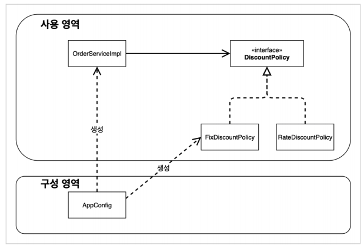
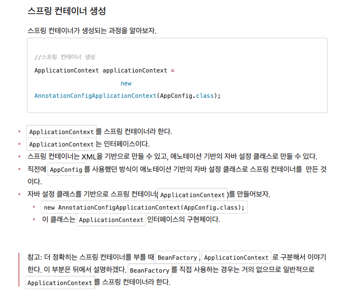
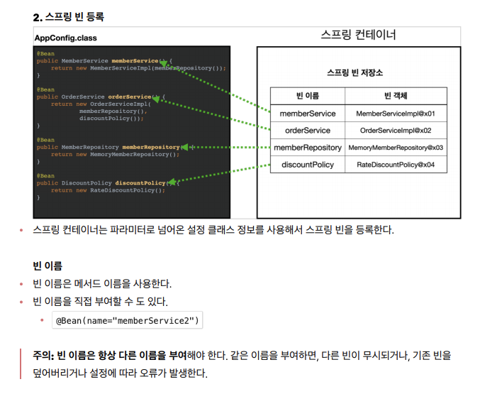
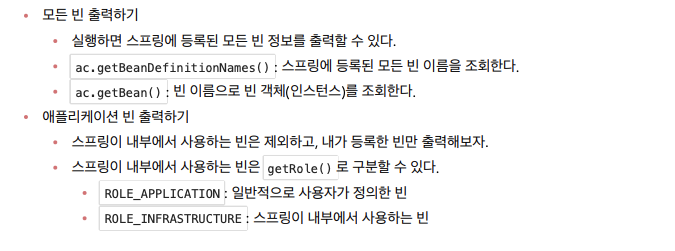
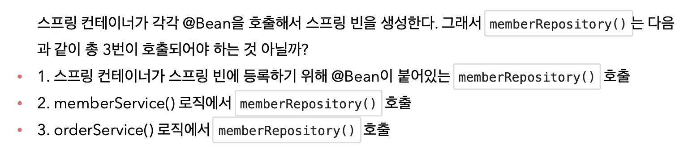
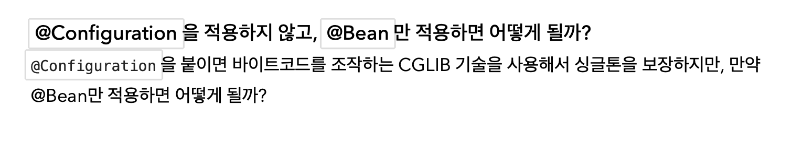
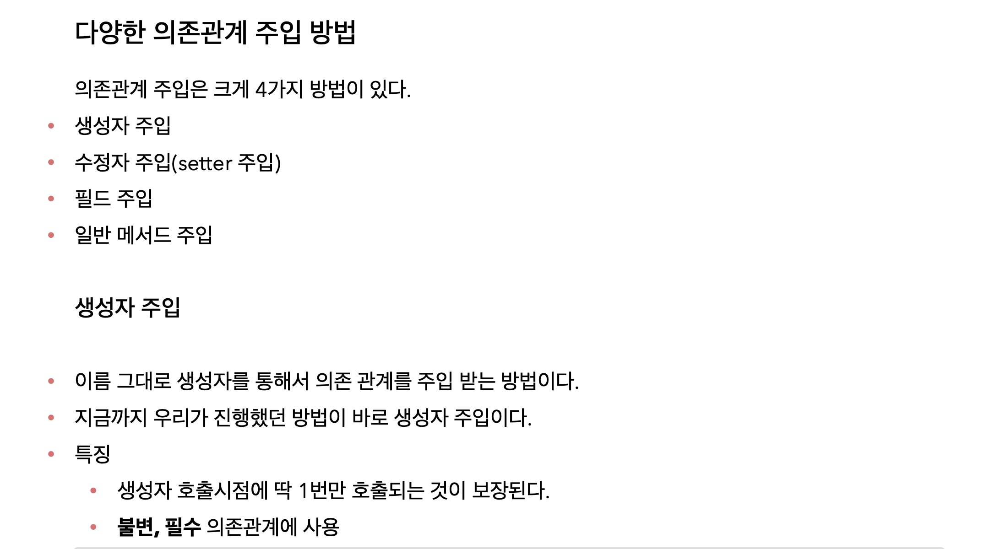

# Spring 핵심 원리 메모


## 좋은 객체지향 설계의 5가지 원칙 (SOLID)
### SOLID 클린코드로 유명한 로버트 마틴이 좋은 객체지향 설계의 5가지 원칙을 정리
* SRP : 단일 책임 원칙(single responsibility principle)
* OCP : 개방-폐쇄 원칙(Open/closed principle)
* LSP : 리스코프 치환원칙(Liskov substitution principle)
* ISP : 인터페이스 분리 원칙(Interface segregation principle)
* DIP : 의존관계 역전 원칙(Dependency inversion principle)
> 앞글자를 따서 SOLID라고 한다.

## 스프링 이야기에 왜 객체지향 이야기가 나오는가?
* 스프링은 다음 기술로 다형성 + OCP, DIP를 가능하게 지원
    * DI(Dependency Injection) : 의존관계, 의존성 주입
    * DI 컨테이나 제공
* 클라이언트 코드의 변경없이 기능 확장
* 쉽게 부품을 교체하듯이 개발

## 정리
* 모든 설계에 *역할*과 *구현*을 분리하자.
* 자동차, 공연의 예를 떠올려보자.
* 애플리케이션 설계도 공연을 설계하듯이 배역만 만들어두고, 배우는 언제든지 *유연*하게 *변경*할 수 있도록 만드는 것이 좋은 객체지향 설계다
* 이상적으로는 모든 설계에 인터페이스를 부여하자
### 실무고민
* 하지만 인터페이스를 도입하면 추상화라는 비용이 발생한다.
* 기능을 확장할 가능성이 없다면, 구체 클래스를 직접 사용하고, 향후 꼭 필요할 때 리팩터링해서 인터페이스를 도입하는것도 방법이다.

## 책 추천
* 객체지향 책 추천 : 객체지향의 사실과 오해
* 스프링 책 추천 : 토비의 스프링
* JPA책 추천 : 자바 ORM표준 JPA 프로그래밍

## 프로젝트 생성 후 세팅
* 커맨드 + , 을 누른 후 Gradle 검색 후 IntelliJ로 바꿔주기

## 비즈니스 요구사항과 설계
* 회원
    * 회원을 가입하고 조회할 수 있다.
    * 회원은 일반과 VIP 두 가지 등급이 있다.
    * 회원 데이터는 자체 DB를 구축할 수 있고, 회부 시스템과 연동할 수 있다.(미확정)
* 주문과 할인 정책
    * 회원은 상품을 주문할 수 있다.
    * 회원 등급에 따라 할인 정책을 적용할 수 있다.
    * 할인 정책은 모든 VIP는 1000원을 할인해주는 고정 금액 할인을 적용해달라. (나중에 변경 될 수 있다.)
    * 할인 정책은 변경 가능성이 높다. 회사의 기본 할인 정책을 아직 정하지 못했고, 오픈 직전까지 고민을 미루고싶다. 최악의 경우 할인을 적요하지 않을 수 도 있다. (미확정)

요구사항을 보면 회원 데이터, 할인 정책같은 부분은 지금 결정하기 어려운 부분이다. 그렇다고 이런 정책이 결정될 때 까지 개발을 무기한 기다릴 수 도 없다. 우리는 앞에서 배운 객체지향 설계방법이 있지않은가!

인터페이스를 만들고 구현체를 언제든지 갈아끼울 수 있도록 설계하면 된다. 그럼 시작해보자.

> *참고 :* 프로젝트 환경설정을 편리하게 하려고 스프링 부트를 사용한 것이다. 지금은 스프링 없는 순수한 잡바로만 개발을 진행한다는 점을 꼭 기억하자! 스프링 관련은 한참 뒤에 등장한다.

## 회원 도메인 설계
* 회원 도메인 요구사항
    * 회원을 가입하고 조회할 수 있다.
    * 회원은 일반과 VIP 두 가지 등급이 있다.
    * 회원 데이터는 자체 DB를 구축할 수 있고, 회부 시스템과 연동할 수 있다.(미확정)
    


### 회원 도메인 설계의 문제점
* 이 코드의 설계상 문제점은 무엇일까요?
* 다른 저장소로 변경할 때 OCP원칙을 잘 준수할까요?
* DIP를 잘 지키고 있을까요?
* *의존과계가 인터페이스 뿐만 아니라 구현까지 모두 의존하는 문제점이 있음*
  * ->*주문까지 만들고나서 문제점과 해결방안을 설명*

## 주문과 할인 도메인 설계
* 주문과 할인 정책
  * 회원은 상품을 주문할 수 있다.
  * 회원등급에 따라 할인 정책을 적용할 수 있다.
  * 할인 정책은 모든 VIP는 1000원을 할인해주는 고정 금액 할인을 적용해달라.(나중에 변경될 수 있다.)
  * 할인 정책은 변경 가능성이 높다. 회사의 기본 할인 정책을 아직 정하지 못했고, 오픈 직전까지 고민을 미루고싶다. 최악의 경우 할인을 적용하지 않을수 도 있다(미확정)
  


> 참고 : 실제로는 주문 데이터를 DB에 저장하겠지만, 예제가 너무 복잡해 질 수 있어서 생략하고, 단순히 주문결과를 반환한다.

### 주문 도메인 전체


### 새로운 할인정책 개발
**새로운 할인 정책을 확장해보자.**
* **악덕 기획자** : 서비스 오픈 직전에 할인 정책을 지금처럼 고정금액 할인이 아니라 좀 더 합리적인 주문 금액당 할인하는 정률% 할인으로 변경하고 싶어요. 예를 들어서 기존 정책은 VIP가 10000원을 주문하든 20000을 주문하든 항상 1000원을 할인했는데, 이번에 새로나온 저책은 10%로 지정해두면 고객이 10000원 주문시 1000원 할인, 20000원 주문시 2000원을 할인해주는거에요!
* **순진 개발자** : 제가 처음부터 고정금액 할인은 아니라고 했잖아요.
* **악덕 기획자** : 애자일 소프트웨어 개발선언 몰라요? “계획을 따르기보다 변화에 대응하기를”
* **순진 개발자** : (유연한 설계가 가능하도록 객체지향 설계원칙을 준수했지 ㅋ)

순진개발자가 정말 객체지향 설계 원칙을 잘 준수 했는지 확인해보자. 이번에는 주문한 금액의 %를 할인해주는 새로운 정률 할인 정책을 추가하자. 


### 새로운 할인 정책 적용과 문제점
**방금 추가한 할인 정책을 적용해보자.**
할인 정책을 변경하려면 할인정책의 클라이언트인 `OrderServiceImpl`코드를 고쳐야 한다.
```java
public class OrderServiceImpl implements OrderService {

//    private final DiscountPolicy discountPolicy = new FixDiscountPolicy(); //고정할인 금액정책
    private final DiscountPolicy discountPolicy = new RateDiscountPolicy();
}
```

**문제점 발견**
* 우리는 역할과 구현을 충실하게 분리했다. -> OK
* 다형성도 활용하고, 인터페이스와 구현 객체를 분리했다.  -> OK
* OCP, DIP 같은 객체지향 설계 원칙을 충실히 준수했다..?
  -> 그렇게 보이지만 사실은 아니다.
* DIP: 주문서비스 클라이언트( `OrderServiceImpl` )는 `DiscountPolicy` 인터페이스에 의존하면서 DIP를 지킨 것 같은데?
  -> 클래스 의존관계를 분석해 보자. 추상(인터페이스) 뿐만 아니라 **구체(구현) 클래스에도 의존**하고 있다.
  * 추상(인터페이스) 의존: `DiscountPolicy `
  * 구체(구현) 클래스: `FixDiscountPolicy` , `RateDiscountPolicy `
* OCP: 변경하지 않고 확장할 수 있다고 했는데!
  * -> **지금 코드는 기능을 확장해서 변경하면, 클라이언트 코드에 영향을 준다!** 따라서 **OCP를 위반**한다.
  

잘보면 클라이언트인 `OrderServiceImpl`이 `DiscountPolicy` 인터페이스 뿐만 아니라 `FixDiscountPolicy` 인 구체 클래스도 함께 의존하고 있다. 실제 코드를 보면 의존하고 있다! **DIP 위반**


**인터페이스에만 의존하도록 설계를 변경하자**


## 관심사의 분리
* 애플리케이션을 하나의 공연이라 생각해보자. 각각의 인터페이스를 배역(배우역할)이라 생각하자. 그런데! 실제 배역 맞는 배우를 선택하는 것은 누가 하는가>
* 로미오와 줄리엣 공연을 하면 로미오 역할을 누가 할지 줄리엣 역할을 누가 할지는 배우들이 정하는게 아니 다. 이전 코드는 마치 로미오 역할(인터페이스)을 하는 레오나르도 디카프리오(구현체, 배우)가 줄리엣 역할 (인터페이스)을 하는 여자 주인공(구현체, 배우)을 직접 초빙하는 것과 같다. 디카프리오는 공연도 해야하고 동시에 여자 주인공도 공연에 직접 초빙해야 하는 *다양한 책임*을 가지고 있다.

### 관심사를 분리하자
* 배우는 본인의 역할인 배역을 수행하는 것에만 집중해야 한다.
* 디카프리오는 어떤 여자 주인공이 선택되더라도 똑같이 공연을 할 수 있어야 한다.
* 공연을 구성하고, 담당 배우를 섭외하고, 역할에 맞는 배우를 지정하는 책임을 담당하는 별도의 *공연 기획자* 가 나올시점이다.
* 공연 기획자를 만들고, 배우와 공연 기획자의 책임을 확실히 분리하자.

### AppConfig 등장
* 애플리케이션의 전체 동작 방식을 구성(config)하기 위해, *구현 객체를 생성*하고, *연결*하는 책임을 가지는 별도의 설정 클래스를 만들자.

* AppConfig는 애플리케이션의 실제 동작에 필요한 *구현 객체를 생성*한다.
  *  `MemberServiceImpl`
  *  `MemoryMemberRepository`
  *  `OrderServiceImpl`
  *  `FixDiscountPolicy`
*  AppConfig는 생성한 객체 인스턴스의 참조(레퍼런스)를 *생성자를 통해서 주입(연결)*I 해준다.
  *  `MemberServiceImpl` ->  `MemoryMemberRepository`
  *  `OrderServiceImpl` ->
     `MemoryMemberRepository` ,`FixDiscountPolicy`

* 설계 변경으로 `MemberServiceImpl` 은 `MemoryMemberRepository` 를 의존하지 않는다!
* 단지 `MemberRepository` 인터페이스만 의존한다.
* `MemberServiceImpl` 입장에서 생성자를 통해 어떤 구현 객체가 들어올지(주입될지)는 알 수 없다.
* `MemberServiceImpl` 의 생성자를 통해서 어떤 구현 객체를 주입할지는 오직 외부(` AppConfig` )에서 결정 된다.
* `MemberServiceImpl` 은 이제부터 **의존관계에 대한 고민은 외부**에 맡기고 **실행에만 집중**하면 된다.


### 그림 - 회원 객체 인스턴스 다이어그램


## AppConfig 리터링
  
**리팩터링 후**
* `new MemoryMemberRepository()` 이 부분이 중복 제거되었다. 이제 `MemoryMemberRepository` 를 다 른 구현체로 변경할 때 한 부분만 변경하면 된다.
* `AppConfig` 를 보면 역할과 구현 클래스가 한눈에 들어온다. 애플리케이션 전체 구성이 어떻게 되어있는지 빠르게 파악할 수 있다.

## 새로운 구조와 할인 정책 적용
* 처음으로 돌아가서 정액 할인 정책을 정률% 할인 정책으로 변경해보자.
* FixDiscountPolicy -> RateDiscountPolicy
* 어떤 부분만 변경하면 되겠는가?

*AppConfig의 등장으로 애플리케이션이 크게 사용 영역과, 객체를 생성하고 구성(Configuration)하는 영역으로 분리되었다.*

그림 - 사용, 구성의 분리



**변경 후**
* `AppConfig` 에서 할인 정책 역할을 담당하는 구현을 `FixDiscountPolicy ` -> `RateDiscountPolicy` 객체로 변경했다.
* 이제 할인 정책을 변경해도, 애플리케이션의 구성 역할을 담당하는 AppConfig만 변경하면 된다. 클라이언 트 코드인 `OrderServiceImpl` 를 포함해서 **사용 영역**의 어떤 코드도 변경할 필요가 없다.
* **구성 영역**은 당연히 변경된다. 구성 역할을 담당하는 AppConfig를 애플리케이션이라는 공연의 기획자로 생각하자. 공연 기획자는 공연 참여자인 구현 객체들을 모두 알아야 한다.

## 전체 흐름 정리
지금까지의 흐름을 정리해보자.
* 새로운 할인 정책 개발
* 새로운 할인 정책 적용과 문제점
* 관심사의 분리
* AppConfig 리팩터링
* 새로운 구조와 할인 정책 적용

**새로운 할인 정책 개발**
다형성 덕분에 새로운 정률 할인 정책 코드를 추가로 개발하는 것 자체는 아무 문제가 없음

**새로운 할인 정책 적용과 문제점**
새로 개발한 정률 할인 정책을 적용하려고 하니 **클라이언트 코드**인 주문 서비스 구현체도 함께 변경해야함 주문 서비스 클라이언트가 인터페이스인 `DiscountPolicy` 뿐만 아니라, 구체 클래스인 `FixDiscountPolicy` 도 함께 의존 -> *DIP 위반*

**관심사의 분리**
* 애플리케이션을 하나의 공연으로 생각
* 기존에는 클라이언트가 의존하는 서버 구현 객체를 직접 생성하고, 실행함
* 비유를 하면 기존에는 남자 주인공 배우가 공연도 하고, 동시에 여자 주인공도 직접 초빙하는 다양한 책임을 가지고 있음
* 공연을 구성하고, 담당 배우를 섭외하고, 지정하는 책임을 담당하는 별도의 **공연 기획자**가 나올 시점
* 공연 기획자인 AppConfig가 등장
* AppConfig는 애플리케이션의 전체 동작 방식을 구성(config)하기 위해, **구현 객체를 생성**하고, **연결**하는 책임
* 이제부터 클라이언트 객체는 자신의 역할을 실행하는 것만 집중, 권한이 줄어듬(책임이 명확해짐)

**AppConfig 리팩터링**
* 구성 정보에서 역할과 구현을 명확하게 분리
* 역할이 잘 들어남
*  중복 제거

**새로운 구조와 할인 정책 적용**
* 정액 할인 정책 -> 정률% 할인 정책으로 변경
* AppConfig의 등장으로 애플리케이션이 크게 **사용 영역**과, 객체를 생성하고 **구성(Configuration)하는 영역**으로 분리
* 할인 정책을 변경해도 AppConfig가 있는 구성 영역만 변경하면 됨, 사용 영역은 변경할 필요가 없음. 물론 클라이언트 코드인 주문 서비스 코드도 변경하지 않음

## 좋은 객체 지향 설계의 5가지 원칙의 적용

여기서 3가지 SRP, DIP, OCP 적용

SRP 단일 책임 원칙  
**한 클래스는 하나의 책임만 가져야 한다.**

* 클라이언트 객체는 직접 구현 객체를 생성하고, 연결하고, 실행하는 다양한 책임을 가지고 있음
* SRP 단일 책임 원칙을 따르면서 관심사를 분리함
* 구현 객체를 생성하고 연결하는 책임은 AppConfig가 담당
* 클라이언트 객체는 실행하는 책임만 담당

DIP 의존관계 역전 원칙  
**프로그래머는 “추상화에 의존해야지, 구체화에 의존하면 안된다.” 의존성 주입은 이 원칙을 따르는 방법 중 하나다.**

* 새로운 할인 정책을 개발하고, 적용하려고 하니 클라이언트 코드도 함께 변경해야 했다. 왜냐하면 기존 클라 이언트 코드( `OrderServiceImpl` )는 DIP를 지키며 DiscountPolicy 추상화 인터페이스에 의존하는 것 같았지만, `FixDiscountPolicy` 구체화 구현 클래스에도 함께 의존했다.
* 클라이언트 코드가 DiscountPolicy 추상화 인터페이스에만 의존하도록 코드를 변경했다.
* 하지만 클라이언트 코드는 인터페이스만으로는 아무것도 실행할 수 없다.
* AppConfig가 FixDiscountPolicy 객체 인스턴스를 클라이언트 코드 대신 생성해서 클라이언트 코드 에 의존관계를 주입했다. 이렇게해서 DIP 원칙을 따르면서 문제도 해결했다.

OCP  
**소프트웨어 요소는 확장에는 열려 있으나 변경에는 닫혀 있어야 한다**

* 다형성 사용하고 클라이언트가 DIP를 지킴
* 애플리케이션을 사용 영역과 구성 영역으로 나눔
* AppConfig가 의존관계를 `FixDiscountPolicy` ->  `RateDiscountPolicy` 로 변경해서 클라이언트 코 드에 주입하므로 클라이언트 코드는 변경하지 않아도 됨
* **소프트웨어 요소를 새롭게 확장해도 사용 역영의 변경은 닫혀 있다!**










### **싱글톤 컨테이너 적용 후**








 





